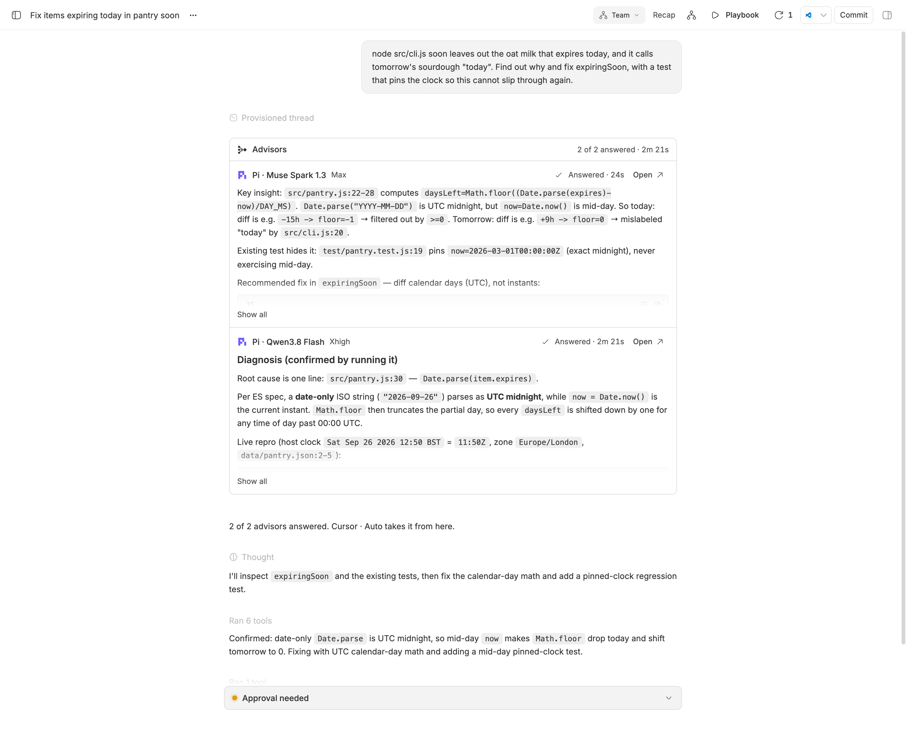
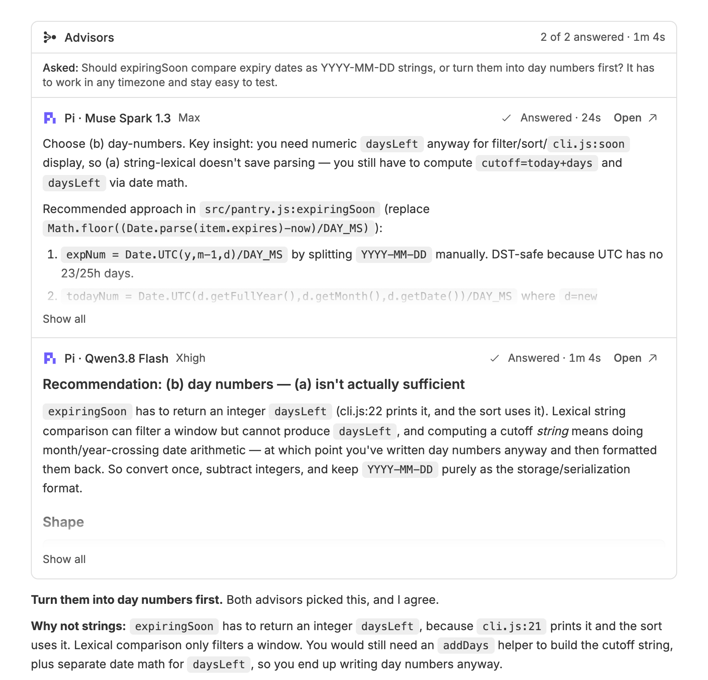
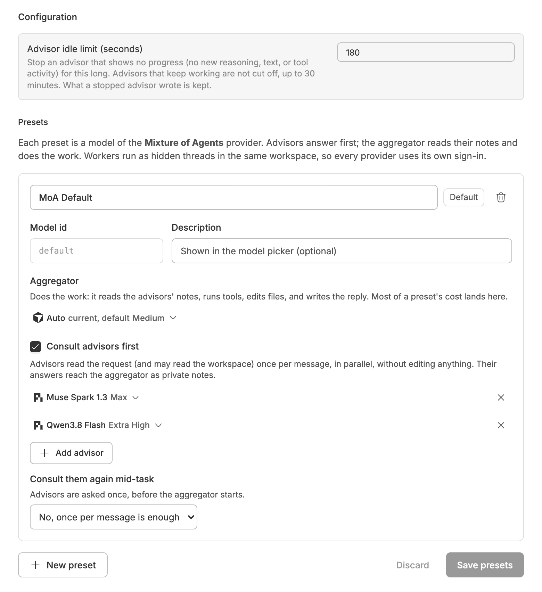
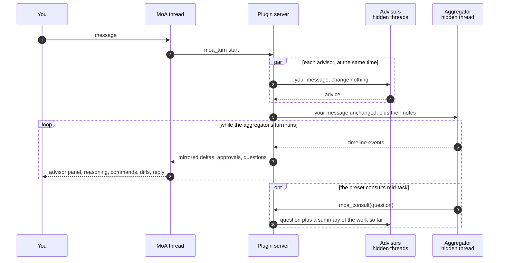

<div align="center">


# Mixture of Agents

### Several models advise. One of them does the work.

Adds a Mixture of Agents provider to BB's model picker, whose models are your presets: advisor agents read the request first, then an aggregator agent reads their notes and does the work.<br>
Any installed provider and model can fill a slot.


[Features](#features) · [Install](#install) · [Where to find it](#where-to-find-it) · [How it works](#how-it-works) · [Safety and privacy](#safety-and-privacy) · [CLI](#cli) · [Settings](#settings) · [Development](#development)

<br>



</div>

<br>

> [!NOTE]
> The screenshots are real BB captures populated with fictional demo data.

## The problem

One thread, one model. The fast one gives you a shallow answer; the thorough
one takes nine minutes and edits your files before you find out it picked the
wrong approach.

You already have several agents signed in on this machine. The awkward part
has always been putting them on the same message: copy the prompt into each
app, read four answers, paste one back, and keep track of which thread is
doing the actual work.

**Mixture of Agents runs that for you.** Pick a preset in the model picker and
every message goes to your advisors in parallel, then to the one agent that
does the work with their notes in hand.

|  | Without Mixture of Agents | With Mixture of Agents |
| --- | :---: | :---: |
| Several models on one message | ❌ | ✅ in parallel, once per message |
| Advice from models with no API key | ❌ | ✅ reuse your provider sign-ins |
| See what each advisor actually said | ❌ | ✅ a live panel per round |
| One agent editing files with that advice | ❌ | ✅ the aggregator's own turn |
| A second opinion mid-task | ❌ | ✅ on request, or every N tool calls |
| Ask the advisors without leaving a thread | ❌ | ✅ `/moa <question>` |

## Features

<table>
<tr>
<td width="50%" valign="top">

### 🧩 Presets are the models

The **Mixture of Agents** provider lists your presets in the model picker.
Each one pairs up to six advisor slots with one aggregator slot — any
provider, model and reasoning level. Up to 32 presets.

</td>
<td width="50%" valign="top">

### 🪜 Advice before the work

Advisors get your message at once, in parallel, and are told to change
nothing. The aggregator gets your message **unchanged**, with their answers
appended as a private notes block.

</td>
</tr>
<tr>
<td valign="top">

### 📺 A panel you can watch

Every round shows as a live card: provider, model, reasoning level, a running
timer, what each advisor is doing right now, and its answer as it streams.
**Open ↗** jumps to that advisor's thread.

</td>
<td valign="top">

### 🔁 The whole turn mirrored

The aggregator's reasoning, commands, file changes, approvals and reply are
forwarded into the MoA thread as they happen. Its approvals and questions
appear there, and your answers go back to it.

</td>
</tr>
<tr>
<td valign="top">

### 💬 `/moa` from any thread

Type `/moa <question>` in a thread on any other provider. That thread's own
agent plays the aggregator: it asks your advisors, shows the panel live, then
weighs their notes in its answer.

</td>
<td valign="top">

### ⏱️ Check-ins mid-task

A preset can give the aggregator a `moa_consult` tool, and nudge it to use
that tool every N tool calls (1–50) before a risky change. Each check-in gets
its own panel.

</td>
</tr>
</table>

<div align="center">
<table>
<tr>
<td align="center"><br><sub><b><code>/moa</code> in a thread on any provider</b></sub></td>
<td align="center"><br><sub><b>Presets, built on BB's own model picker</b></sub></td>
</tr>
</table>
</div>

## Install

This plugin is not published yet, so install it from a local clone:

```sh
cd bb-plugin-moa
npm install && bb plugin build
bb plugin install path:$PWD --yes
```

That's it. On first load the plugin creates a **MoA Default** preset from the
providers installed on this machine, and `/moa` works in every thread. Once
the repository is public, `bb plugin install git:https://github.com/MacHatter1/bb-plugin-moa --yes`
rebuilds `dist/` for you.

**Requirements**

- bb **0.43+** (Plugin SDK 0.5.9+)
- At least one agent provider signed in. A preset's slots must use providers
  other than Mixture of Agents itself.

## Where to find it

| Where | What |
| --- | --- |
| **Model picker** | Choose **Mixture of Agents**, then a preset. Each preset is one "model". |
| **The thread** | The advisor panel for each round, then the aggregator's work as it happens. |
| **Settings → Plugins → Mixture of Agents** | The **Presets** page: name, description, aggregator, advisors, mid-task consulting. |
| **The composer** | `/moa <question>`, and **Ask Mixture of Agents** in the **+** menu. |
| **`bb thread list --include-hidden`** | The worker threads. Their titles start with `MoA advisor ·` or `MoA aggregator ·`. |

## How it works



- **Every slot is an ordinary BB thread.** Advisors and the aggregator run as
  hidden worker threads in the MoA thread's environment, on their own
  provider and with that provider's own sign-in. Workers belong to the MoA
  thread: they archive and delete with it, and they are reused on later
  messages, so each keeps its own context.
- **The notes are appended, not interleaved.** The aggregator receives your
  message verbatim, followed by a `<moa_advisor_notes>` block, so its cached
  conversation prefix survives. That is how Hermes' MoA works.
- **The plugin runs no model.** `src/bridge.ts` is a provider bridge: on each
  turn it hands the message to the plugin server through the internal
  `moa_turn` tool, long-polls for deltas, and raises the aggregator's
  approvals in your thread.
- **Advisors never block on you.** They run in the MoA thread's permission
  mode (Accept Edits for `/moa`), or the nearest mode their provider has, and
  are told to change nothing. Any approval or question they raise is declined,
  so a hidden advisor cannot sit waiting for a click.
- **A turn costs one advisor turn per advisor, plus the aggregator's turn.**
  Most of the cost is the aggregator's, since that is the turn that works.

<details>
<summary><b>Steering, check-ins and the every-N nudge</b></summary>

MoA turns cannot be steered: a message you send mid-turn runs as the next
turn. Mid-task check-ins are sent with BB's ordinary steer right after a tool
call finishes, so they work with any aggregator — Claude Code, Codex and Pi
inject it into the running loop, and the ACP agents (Cursor, opencode, Grok,
Antigravity) cancel the in-flight prompt and continue with the check-in in the
same turn, with full context.

An unanswered check-in holds off the next one for 2×N tool calls, so a
check-in that lands a step late is not followed by a second one. When an ACP
agent asks permission to run `moa_consult` (they gate every MCP tool), the
plugin grants it itself: the tool only reads.

</details>

<details>
<summary><b>How it compares with Hermes Agent</b></summary>

| Hermes | This plugin |
| --- | --- |
| `reference_models` | Advisor slots: any BB provider and model, each with its own reasoning level |
| `aggregator` | Aggregator slot: runs that provider's own agent harness and tools |
| `fanout: user_turn` | "No, once per message is enough" (the default) |
| `fanout: every_n:N` | "Every few tool calls": check-ins every N tool calls, answered with `moa_consult` |
| `fanout: per_iteration` | Closest is every 1 tool call; the loop itself runs inside the provider |
| — | "When the aggregator asks": `moa_consult` only, at the model's discretion |
| `enabled: false` | **Consult advisors first** off: the aggregator answers alone |
| References get no tools | Advisors can read files and run read-only commands, and are told to change nothing and keep to the workspace |
| Recursive presets blocked | Same: a slot cannot use the Mixture of Agents provider |
| Temperatures, privacy filter | Not available: providers own sampling, and nothing filters what an advisor reads |

</details>

<details>
<summary><b>Limitations</b></summary>

- Work the aggregator starts in the background, and anything it does after its
  turn ends, stays in the hidden worker thread. Open the worker to see it.
- Items nested under the aggregator's own sub-agents are not mirrored; the
  sub-agent row and its summary are.
- Check-ins count the aggregator's **tool calls**, not its model calls, so N is
  not exactly Hermes' iteration count, and the aggregator has to act on a
  check-in.
- Changing a preset's mid-task setting takes effect on an existing MoA thread's
  next message: the aggregator's session restarts to pick up (or drop)
  `moa_consult`.
- A provider that needs approval just to read files gives thinner advice,
  since advisor approvals are declined.
- Threads started before this plugin was installed or updated get `moa_ask`
  once their session restarts.

</details>

## Safety and privacy

- 🚫 **Advisors are told to change nothing.** That is an instruction, not a
  lock. Any approval they ask for is declined, and BB's workspace sandbox stops
  writes outside the workspace. But Accept Edits and Auto let an agent edit
  inside the workspace without asking, and a provider with only full access,
  such as Pi, has no sandbox at all.
- 📂 **Advisors can read beyond the workspace.** They are asked to keep to it
  unless your question is about something outside, but no provider's sandbox
  blocks reads, for advisors or any other thread. What an advisor reads goes to
  its slot's model provider, so choose a preset's providers as you would for
  any thread.
- 🔒 **Nothing new to sign in to.** Slots run on the providers already
  installed on your machine. No API keys, no proxy, no third-party service.
- 👁️ **Nothing hidden from you.** Every advisor round is a panel in your
  thread, every worker thread is listable, and the notes block the aggregator
  sees is the text in that panel.
- ⏳ **Rounds end.** An advisor that shows no progress for
  `advisorTimeoutSeconds` (180 by default) is stopped and what it wrote still
  reaches the aggregator, marked as cut off. A round that keeps working is
  capped at 30 minutes, and a mid-task check-in at 4.

## CLI

```sh
bb moa list                    # each preset with its aggregator and advisor slots
bb moa list --json             # the stored shape, for scripts
```

<details>
<summary><b>All commands</b></summary>

| Command | Does |
| --- | --- |
| `bb moa list` | Prints every preset: id (the default one marked), name, aggregator, advisors, and how often they are asked. Exits with `no_presets` when there are none. |
| `bb moa list --json` | Prints the same store as JSON. |

Presets are written in the settings page; there is no CLI for that.

</details>

**Agent tools:** `moa_ask({ question, context, preset })` and
`moa_answers({ round })` serve `/moa` in an ordinary thread;
`moa_consult({ question })` is offered only to an aggregator whose preset
consults mid-task; `moa_turn` is the bridge's private channel and is not for
agents. The bundled [moa](skills/moa/SKILL.md) and
[moa-threads](skills/moa-threads/SKILL.md) skills teach agents both paths.

## Settings

`bb plugin config moa`, or **Settings → Plugins → Mixture of Agents**.

<details>
<summary><b>All settings</b></summary>

| Setting | Default | |
| --- | --- | --- |
| `advisorTimeoutSeconds` | `180` (30–1800) | Stop an advisor that shows no progress — no new reasoning, text, or tool activity — for this long. Advisors that keep working are not cut off by it. What a stopped advisor wrote is kept. |

Presets themselves are stored in the plugin's own key-value store and edited
on the **Presets** page: name (≤60 characters), description (≤240), id
(`a-z0-9` and dashes, ≤48), one aggregator, up to six advisors, **Consult
advisors first**, and **Consult them again mid-task** (once per message / when
the aggregator asks / every N tool calls).

</details>

<details>
<summary><b>Turning it off</b></summary>

```sh
bb plugin disable moa
bb plugin enable moa
```

`bb plugin remove moa` removes the plugin and its settings.

To keep the plugin but stop consulting: switch off **Consult advisors first**
on a preset and its aggregator answers alone. To stop finished MoA turns from
folding their steps:

```sh
bb settings completed-turns moa flat
```

</details>

## Development

```sh
npm install
npm test
npm run typecheck
bb plugin build
bb plugin install path:$PWD --yes
bb plugin dev                      # rebuild and reload on every save
```

```
server.ts              provider, settings, RPC, `bb moa`, and the four agent tools
host.ts                the daemon's entry point for the provider bridge
app.tsx                the Presets page, the composer action, and the panel slot
src/bridge.ts          the provider bridge: moa_turn, long-polling, approvals
src/wire.ts            the moa_turn schema shared by the bridge and the server
src/runs.ts            the orchestrator: advisors, aggregator, check-ins, /moa
src/mirror.ts          aggregator timeline → thread/delta, tool-call counting
src/advisor-stream.ts  one advisor's live activity and answer, for its panel row
src/rounds.ts          advisor rounds in SQLite, for the panels
src/advisor-panel.tsx  the ::moa-advisors message directive
src/agent-config.ts    which tools and skills each thread is offered
src/prompts.ts         the text advisors and aggregators see
src/presets.ts         the preset schema shared by server, app and CLI
src/constants.ts       limits and ids, kept free of zod for the app bundle
skills/                the two bundled agent skills
test/                  vitest suites and a recorded aggregator turn
docs/                  logo and screenshots
```

**Tests** run on vitest with no network and no real BB server:
`test/bridge.conformance.test.ts` runs BB's provider-bridge conformance suite
against the bridge with a fake server answering `moa_turn`;
`test/bridge.stream.test.ts` feeds a recorded Claude Code turn through the
mirror, the bridge and BB's own delta assembler; `test/runs.test.ts` drives the
orchestrator against a scripted stand-in for `bb.sdk`; `test/prompts.test.ts`,
`test/mirror.test.ts`, `test/advisor-stream.test.ts` and
`test/agent-config.test.ts` cover the prompt text, the timeline mapping and
which tools each thread is offered.

**Maintainer notes.** The advisor panel only appears in a real thread, so
verify visual changes by reloading the plugin (`bb plugin reload moa`) and
sending a message to a MoA thread. `bb plugin build` must pass before a path
install picks up your changes.

`PLUGIN_OVERVIEW.md` is the store listing. Keep it in step with
`bb.description` in `package.json`, the README and the two skills.

## Licence

[MIT](LICENSE)
